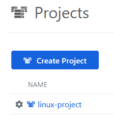
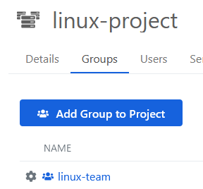

# Terraform Okta Advanced Server Access (ASA) Ubuntu Demo #

This project will stand up an Okta ASA Project and Ubuntu EC2 instance in order to demo how to SSH into an AWS EC2 instance with Okta ASA client.

This project references the following [Okta blog](https://developer.okta.com/blog/2020/04/24/okta-terraform-automate-identity-and-infrastructure)

For additional information about Terraform AWS and Okta ASA providers click the following links:

* [AWS Terraform Provider](https://registry.terraform.io/providers/hashicorp/aws/latest/docs)
* [Okta Advanced Server Access Provider](https://registry.terraform.io/providers/oktadeveloper/oktaasa/latest/docs)

## Disclaimer :warning:
---
This project serves as a Sample Demo, that you can tweak or completely re-purpose.

## Prerequisties
* Terraform v1.1.9+
* Amazon Web Service (AWS) Tenant -- If you do not already have an AWS Tenant, you can create one [here](https://portal.aws.amazon.com/billing/signup#/start/email).
* Okta Tenant -- If you do not already have an Okta tenant, you can register for a free one here  [Okta Free Trial](https://www.okta.com/free-trial/)
* Okta ASA Account -- you can register for one here [Okta ASA Free Tenant](https://app.scaleft.com/p/signup)

### Demo Setup Steps
1. Create an Okta Advanced Server Access API User [How-to](https://developer.okta.com/blog/2020/04/24/okta-terraform-automate-identity-and-infrastructure#create-an-okta-advanced-server-access-api-user)
2. Create an AWS IAM User [How-to](https://developer.okta.com/blog/2020/04/24/okta-terraform-automate-identity-and-infrastructure#create-an-aws-iam-user)
3. Install Advanced Server Access client for your system. [How-to](https://help.okta.com/asa/en-us/Content/Topics/Adv_Server_Access/docs/sft.htm)

## Assumptions
This assumes you the following basic knowledge of Okta ASA project, such as importing/create users in your ASA instance, adding users to ASA group, using the SFT client to SSH into a machine and connecting your ASA instance to your current Okta enviornment.

## Installation and Configuration
1. Clone the repo
```bat
git clone https://github.com/whitesand230/terraform-okta-asa-linux-demo
```
2. Copy the contents of the terraform.tfvars.example file.
```powershell
#Windows
copy terraform.tfvars.example terraform.tfvars

#Linux
cp terraform.tfvars.example terraform.tfvars
```

3. Update the varriables in the terraform.tfvars file from the info gathered during the [Demo Setup Steps](#demo-setup-steps)

```powershell
//AWS Config
aws_region = "us-east-1"
aws_access_key = "my-access-key"
aws_secret_key = "my-aws_secret_key"
//Optional
//aws_aws_instance_ami = "ami-0e14491966b97e8bc"
//aws_instance_type = "t2.micro"


//Okta ASA
okta_asa_key_secret = "asa_key_secret"
okta_asa_key = "asa_key"
okta_asa_team = "team-name"
```

4. Save the terraform.tfvars file.
5. Run `terraform init`
6. Run `terraform plan`
7. Run `terraform apply --auto-approve`


8. After the terraform script completes, go to your ASA console. Navigate to the newly created 'linux-project'.



9. Add any user to 'linux-team' group



10. Login with the users on your SFT client or the ASA dashboard and the server will be displayed for the user to access.


## Contributing
---
Pull requests are welcome. For major changes, please open an issue first to discuss what you would like to change.

Please make sure to update tests as appropriate.

## License
---
[MIT](https://choosealicense.com/licenses/mit/)